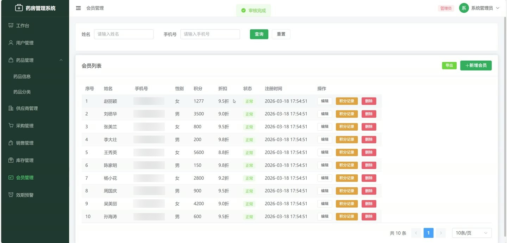
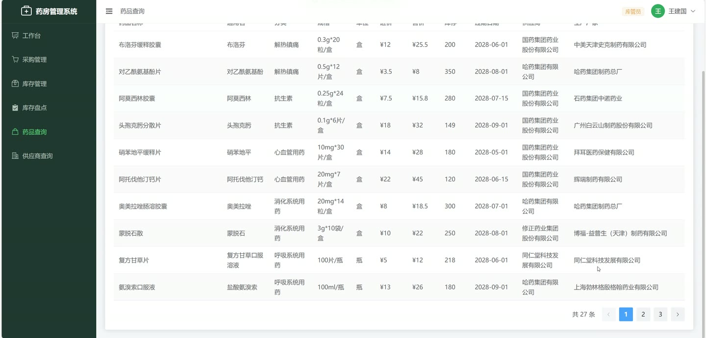
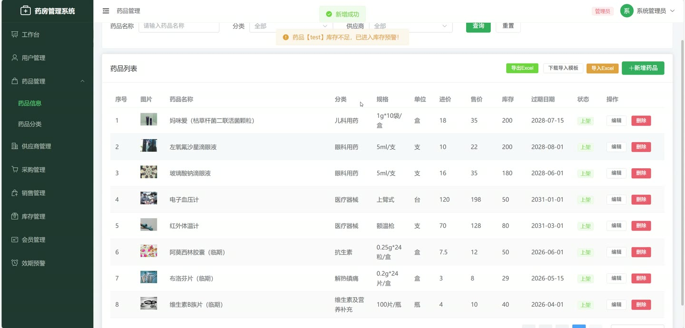
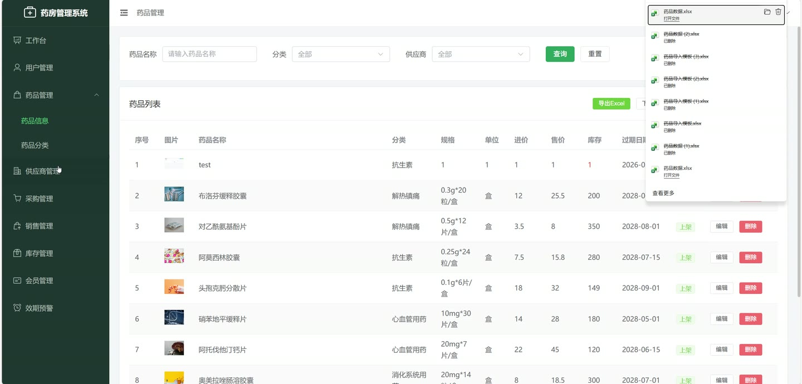
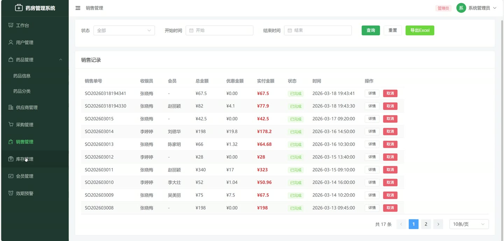
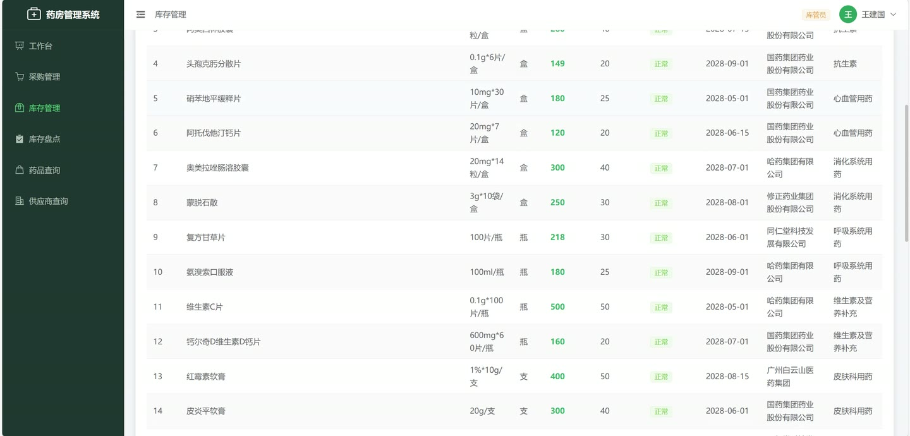

# (附文档)Springboot3+MySQL+Vue3 药房管理系统

**技术栈**：Springboot3、MySQL

### 系统简介

基于 Spring Boot 3 + MySQL 的药房管理系统，采用前后端分离架构。系统支持管理员、收银员、库管员三种角色，覆盖药品管理、前台收银、库存盘点、采购管理、会员管理、销售统计等药房核心业务场景。
 
### 核心功能
 
### 管理员端

 
- 药品管理：新增/编辑/删除药品信息，支持按药品名称、分类、供应商、状态筛选分页查询 
- 药品分类管理：新增/编辑/删除药品分类，支持按分类名称模糊搜索 
- 供应商管理：新增/编辑/删除供应商信息，支持按供应商名称模糊搜索 
- 用户管理：新增/编辑/删除系统用户（收银员/库管员），支持按用户名、姓名、角色筛选 
- 重置用户密码：一键将指定用户密码重置为 123456 
- 审核采购单：对库管员提交的采购单进行通过/驳回审核，审核通过后自动增加对应药品库存 
- 审核盘点记录：对库管员提交的库存盘点记录进行通过/驳回审核，审核通过后更新药品库存 
- 查看销售统计：查看日/月/年销售额趋势图、TOP10 销售药品、今日/本月销售额 
- 查看采购统计：查看月度采购金额趋势、TOP5 供应商采购金额排名 
- 查看近效期预警：列出 3 个月内即将过期的药品列表，按过期日期升序排列 
- 查看库存预警：列出当前库存低于库存下限的药品列表，按库存数量升序排列 
- 智能采购建议：基于近 3 个月月均销量自动计算建议采购量（月均销量×2 - 当前库存），并显示建议采购金额 
- 导出数据：支持导出药品、会员、供应商、销售记录等 Excel 报表 
- 批量导入：通过 Excel 模板批量导入药品、会员、供应商数据
 
### 收银员端

 
- 前台开单：扫描/搜索药品添加到销售单，自动计算总金额、会员折扣金额、实付金额 
- 会员识别：输入会员手机号快速查询会员信息，自动应用会员折扣率 
- 会员积分：销售完成后自动为会员增加积分（1 元积 1 分） 
- 库存实时扣减：开单成功后自动扣减对应药品库存 
- 取消销售单：取消已完成的销售单，自动恢复药品库存 
- 查看个人业绩：查看今日/本月销售金额、今日订单数、近 7 天销售趋势 
- 查看销售记录：按时间范围、状态筛选查看历史销售单，支持导出 Excel 
- 修改个人信息：修改本人姓名、手机号等基本信息 
- 修改密码：修改本人登录密码
 
### 库管员端

 
- 创建采购单：选择供应商、添加药品明细（药品、数量、单价），自动计算采购总金额，生成采购单号 
- 查看采购单列表：按状态、供应商、创建人、时间范围筛选查看采购单 
- 库存盘点：选择药品录入实际库存数量，系统自动记录盘点前库存，提交后等待管理员审核 
- 查看盘点记录：按药品、状态、盘点人筛选查看历史盘点记录 
- 查看药品列表：按名称、分类、供应商、状态筛选查看药品信息 
- 查看近效期预警：查看 3 个月内即将过期的药品列表 
- 查看库存预警：查看库存低于下限的药品列表 
- 查看智能采购建议：查看系统基于销量自动计算的采购建议 
- 修改个人信息：修改本人姓名、手机号等基本信息 
- 修改密码：修改本人登录密码
 
### 技术栈

 后端框架Spring Boot 3 ORMMyBatis-Plus 权限认证JWT（JSON Web Token） 密码加密Spring Security Crypto PasswordEncoder 数据库MySQL Excel 处理EasyExcel（导入/导出） 前端框架Vue.js（SPA 单页应用） 构建工具Maven
 
### 交付内容

 
- 后端完整源码 
- 前端完整源码 
- 数据库初始化脚本 
- 万字文档

## 界面展示

---

## 获取完整源码 + 万字文档

本仓库为项目介绍页。**完整前后端源码、数据库初始化脚本、万字项目文档**，请加微信 `kangkangcode`，或访问 [codekk.top](http://codekk.top) 获取。

可作课程设计 / 毕业设计参考，支持远程部署调试。